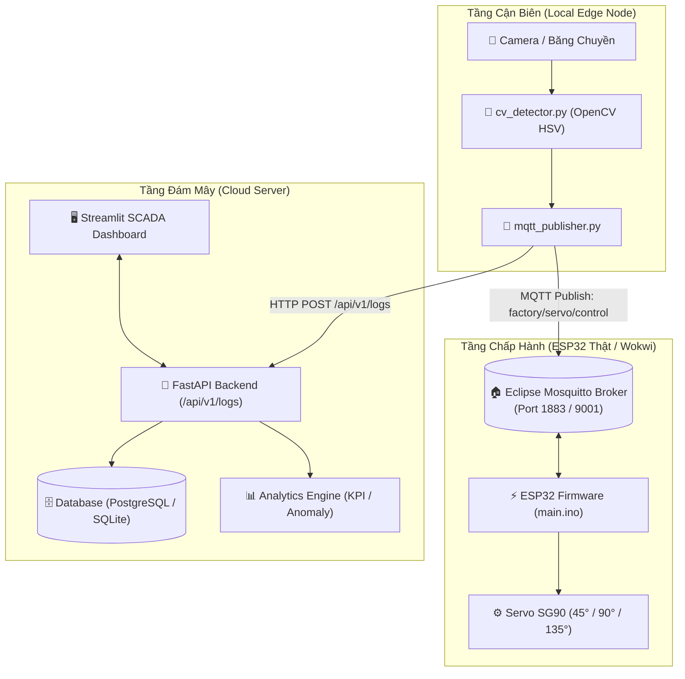

# 🏭 IoT Sorting System (Level 4 Architecture)

Hệ thống IoT Cấp độ 4 (Level 4 SCADA & Cloud Architecture) tự động nhận diện và phân loại 3 dòng sản phẩm theo màu sắc (**Đỏ - RED**, **Vàng - YELLOW**, **Xanh lá - GREEN**) trên băng chuyền công nghiệp bằng **Computer Vision (OpenCV)**, kết hợp điều khiển cơ cấu chấp hành **ESP32 & Động cơ Servo (Wokwi)** qua giao thức **MQTT**, cùng hệ thống **Cloud Backend (FastAPI)** và giao diện giám sát vận hành **SCADA Dashboard (Streamlit)** theo thời gian thực.

---

## 📑 Mục lục
- [1. Tổng quan kiến trúc hệ thống](#1-tổng-quan-kiến-trúc-hệ-thống)
- [2. Cấu trúc thư mục dự án](#2-cấu-trúc-thư-mục-dự-án)
- [3. Đặc tả triển khai chi tiết](#3-đặc-tả-triển-khai-chi-tiết)
  - [Bước 1: Xây dựng Cloud Service (FastAPI + PostgreSQL/SQLite + Streamlit)](#bước-1-xây-dựng-cloud-service)
  - [Bước 2: Lập trình Local Edge Node (Computer Vision & MQTT)](#bước-2-lập-trình-local-edge-node)
  - [Bước 3: Lập trình Giả lập phần cứng ESP32 & Servo (Wokwi)](#bước-3-lập-trình-giả-lập-phần-cứng-esp32--servo)
- [4. Thông số kỹ thuật & Giao thức truyền thông](#4-thông-số-kỹ-thuật--giao-thức-truyền-thông)
- [5. Hướng dẫn cài đặt & Vận hành](#5-hướng-dẫn-cài-đặt--vận-hành)
- [6. Kịch bản kiểm thử (Testing Checklist)](#6-kịch-bản-kiểm-thử)

---

## 1. Tổng quan kiến trúc hệ thống

Mô hình hệ thống tuân theo chuẩn kiến trúc IoT 4 cấp độ (Level 4 Architecture):
- **Tầng Cận biên (Local Edge & Actuation Layer):** 
  - **Edge Node:** Thu thập luồng hình ảnh từ Camera/Băng chuyền, áp dụng thuật toán Computer Vision (Color Masking / HSV) để nhận diện 3 nhãn màu (RED, YELLOW, GREEN).
  - **Actuator Node (ESP32):** Nhận tín hiệu điều khiển qua giao thức MQTT để xoay góc Servo phân loại sản phẩm vào đúng khay chứa.
- **Tầng Điện toán Đám mây (Cloud & Presentation Layer):** 
  - **Cloud Backend API:** Tiếp nhận log phân loại, lưu trữ vào Database (PostgreSQL/SQLite), xử lý Analytics tính toán năng suất và phát hiện bất thường (Anomaly Detection).
  - **SCADA Web Dashboard:** Phân quyền người dùng (Role-Based Access Control - Worker & Manager), hiển thị KPI, biểu đồ phân tích trực quan và hỗ trợ xuất báo cáo.



---

## 2. Cấu trúc thư mục dự án

```text
iot-sorting-system/
├── local_edge/                     # [TẦNG EDGE] Module Thị giác máy tính & Gửi tin
│   ├── cv_detector.py              # Xử lý hình ảnh nhận diện 3 màu (Đỏ, Vàng, Xanh)
│   ├── mqtt_publisher.py           # Module điều phối gửi MQTT tới ESP32 & HTTP tới Cloud
│   ├── config.py                   # Cấu hình Camera ID, IP Backend, MQTT Broker Topic
│   └── requirements.txt            # Thư viện OpenCV, paho-mqtt, requests...
│
├── esp32_firmware/                 # [TẦNG PHẦN CỨNG] Giả lập Wokwi & Mã nguồn nhúng
│   ├── diagram.json                # Sơ đồ kết nối mạch Wokwi (ESP32 + Servo SG90)
│   └── main.ino                    # Firmware C++ ESP32 nhận MQTT điều khiển góc quay Servo
│
├── cloud_server/                   # [TẦNG CLOUD & BROKER] Dịch vụ Backend, SCADA & Broker
│   ├── docker-compose.yml          # Triển khai trọn gói Database + Mosquitto + Backend + Dashboard
│   ├── mosquitto/                  # Cấu hình Eclipse Mosquitto MQTT Broker nội bộ
│   │   └── config/mosquitto.conf   # Cho phép kết nối LAN port 1883 & WebSocket 9001
│   ├── backend/
│   │   ├── Dockerfile
│   │   ├── requirements.txt
│   │   ├── database.py             # Cấu hình SQLAlchemy (Postgres / SQLite)
│   │   ├── models.py               # ORM Models (User, SortingLog, SystemConfig)
│   │   ├── schemas.py              # Pydantic Schemas validate dữ liệu
│   │   ├── auth.py                 # Xác thực bảo mật JWT & Phân quyền RBAC
│   │   ├── analytics.py            # Tính toán thống kê KPI, sản lượng & Anomaly Detection
│   │   ├── main.py                 # FastAPI RESTful API Server
│   │   └── mock_sender.py          # Script giả lập dữ liệu gửi mẫu
│   │
│   └── dashboard/
│       ├── Dockerfile
│       ├── requirements.txt
│       ├── app.py                  # Master Router, Cookie Session & State Management
│       ├── config.py               # Token màu sắc công nghiệp, API Endpoints
│       ├── styles.py               # Dark Glassmorphism SCADA Theme, chống nhấp nháy UI
│       ├── services/
│       │   ├── auth_service.py     # Quản lý phiên đăng nhập & Cookie
│       │   └── api_client.py       # Central HTTP Client gọi API Backend
│       └── views/
│           ├── login_view.py       # Màn hình đăng nhập tài khoản
│           ├── worker_view.py      # Màn hình Giám sát vận hành (Operator - Read Only)
│           └── manager_view.py     # Màn hình Điều hành & Quản trị (Manager - 4 Tabs)
│
├── README.md                       # Tài liệu kỹ thuật toàn bộ dự án
└── requirements.txt                # Thư viện gốc toàn bộ môi trường
```

---

## 3. Đặc tả triển khai chi tiết

### Bước 1: Xây dựng Cloud Service (FastAPI + Database + Dashboard)
1. **Database Schema (`models.py`):**
   - Bảng `sorting_logs`: `id`, `color_label` (`RED`, `YELLOW`, `GREEN`), `confidence`, `created_at` (chuẩn múi giờ GMT+7).
   - Bảng `system_config`: cấu hình ngưỡng cảnh báo bất thường (`consecutive_anomaly_threshold`), thời gian làm mới,...
   - Bảng `users`: quản lý tài khoản (`worker`, `manager`) với mật khẩu băm bcrypt.
2. **Backend REST API (`main.py`):**
   - `POST /api/v1/logs`: Nhận dữ liệu phân loại từ Edge Node.
   - `GET /api/v1/logs`: Truy vấn lịch sử phân loại có bộ lọc đa năng (`color_label`, `start_time`, `end_time`, `shift`).
   - `GET /api/v1/stats`: Thống kê tổng hợp số lượng, tỷ lệ %, năng suất có hỗ trợ lọc theo mốc thời gian/ca làm việc.
   - `GET /api/v1/analytics/oee`: Phân tích bộ chỉ số OEE công nghiệp ($OEE = A \times P \times Q$) kèm đánh giá phân cấp quốc tế.
   - `GET /api/v1/analytics/target-vs-actual`: Đối chiếu tiến độ sản xuất Kế hoạch vs Thực tế và dự báo thời gian cán đích (ETA).
   - `GET /api/v1/analytics/heatmap-matrix`: Cung cấp ma trận nhiệt 24h x 7 ngày & 24h x 3 màu nhận diện điểm nghẽn năng suất.
   - `GET /api/v1/analytics/servo-health`: Đo lường vòng đời, tỷ lệ hao mòn (Wear %) và cân bằng tải động cơ Servo SG90.
   - `GET /api/v1/export/csv`: Xuất dữ liệu nhật ký phân loại ra file CSV.
3. **Analytics Engine (`analytics.py`):**
   - Thống kê phân bố tỷ lệ sản phẩm theo màu sắc.
   - Đo lường chỉ số **OEE công nghiệp (Overall Equipment Effectiveness)**: Tính sẵn sàng ($A$), Hiệu suất vận hành ($P$), Chất lượng nhận diện ($Q$).
   - Giám sát tiến độ **Target vs Actual** & phân bổ kế hoạch theo từng màu sắc.
   - Sinh ma trận phân bổ nhiệt năng suất 24H (**24-Hour Productivity Heatmap Matrix**).
   - Phân tích chỉ số hao mòn cơ cấu cơ khí Servo SG90 (45°, 90°, 135°).
4. **SCADA Dashboard (`app.py`):**
   - Xây dựng trên nền tảng **Streamlit** với ngôn ngữ thiết kế **Industrial Dark SCADA & Minimalism** (không emoji gây rối mắt, dùng typography và LED dots).
   - Phân quyền người dùng (Role-Based Access Control):
     - **Worker (Vận hành):** Giám sát trực tiếp các thẻ KPI, trạng thái cảnh báo, bảng log mới nhất với cơ chế tự làm mới độc lập `@st.fragment`.
     - **Manager (Quản lý):** 4 Tab chuyên sâu: Giám sát thời gian thực, Phân tích OEE Gauge & Tiến độ kế hoạch Target vs Actual, Ma trận nhiệt Heatmap 24h, Diễn biến xu hướng & sản lượng tích lũy (Cumulative Area Chart), Giám sát sức khỏe Servo, Bộ lọc ca sản xuất, Cấu hình hệ thống & Xuất báo cáo, Quản lý tài khoản nhân viên.
5. **Docker Containerization (`docker-compose.yml`):**
   - Đóng gói toàn bộ các dịch vụ (PostgreSQL, Backend API, Streamlit Dashboard) để triển khai bằng 1 lệnh duy nhất.


---

### Bước 2: Lập trình Local Edge Node (Computer Vision & MQTT)
1. **Thuật toán Computer Vision (`cv_detector.py`):**
   - Sử dụng **OpenCV** chuyển đổi không gian màu sang **HSV (Hue, Saturation, Value)**.
   - Áp dụng kỹ thuật phân vùng màu (Color Masking) cho 3 dải màu:
     - **Đỏ (RED):** Kết hợp 2 dải HSV `[0, 100, 100] -> [10, 255, 255]` và `[170, 100, 100] -> [180, 255, 255]`.
     - **Vàng (YELLOW):** Dải HSV `[20, 100, 100] -> [35, 255, 255]`.
     - **Xanh lá (GREEN):** Dải HSV `[40, 50, 50] -> [85, 255, 255]`.
   - Xác định vùng nhận diện (ROI - Region of Interest) trên luồng video để ghi nhận sản phẩm khi đi qua vạch phân loại.
2. **Tích hợp truyền thông (`mqtt_publisher.py`):**
   - Khi phát hiện vật thể hợp lệ, đóng gói payload JSON:
     ```json
     {
       "color": "RED",
       "confidence": 0.96,
       "timestamp": "2026-10-06T21:30:00+07:00"
     }
     ```
   - Gửi bản tin MQTT tới Topic `factory/servo/control` để kích hoạt cơ cấu gạt ESP32.
   - Đồng thời gửi HTTP `POST /api/v1/logs` lên Cloud Backend để lưu trữ nhật ký vào PostgreSQL.

---

### Bước 3: Lập trình Giả lập phần cứng ESP32 & Servo (Wokwi & Local Mock)
1. **Thiết lập sơ đồ Wokwi (`diagram.json`):**
   - 1 vi điều khiển ESP32 DevKit V1.
   - 1 động cơ Servo SG90 (Chân điều khiển PWM kết nối với GPIO 18, nguồn 5V và GND).
2. **Firmware điều khiển (`main.ino`):**
   - Kết nối Wi-Fi Wokwi (`Wokwi-GUEST`).
   - Kết nối tới MQTT Broker (HiveMQ) và lắng nghe topic `factory/servo/control`.
   - **Quy tắc điều khiển góc quay:**
     - Nhận lệnh `"RED"` $\rightarrow$ Quay Servo về góc **$45^\circ$**
     - Nhận lệnh `"YELLOW"` $\rightarrow$ Quay Servo về góc **$90^\circ$**
     - Nhận lệnh `"GREEN"` $\rightarrow$ Quay Servo về góc **$135^\circ$**
     - Tự động quay về vị trí nghỉ ban đầu (**$0^\circ$**) sau 2 giây trễ.
   - Tích hợp tính năng **Self-Test** tự kiểm tra Servo lúc khởi động.
3. **Script Giả lập Terminal (`mock_esp32.py`):**
   - Chạy trực tiếp trên máy tính để mô phỏng ESP32 nhận MQTT và in góc quay Servo mà không phụ thuộc trình duyệt.

---

## 4. Thông số kỹ thuật & Giao thức truyền thông

### A. MQTT Broker (Eclipse Mosquitto Nội Bộ / LAN)
* **Broker Engine:** Eclipse Mosquitto v2.0+ (Containerized / Local).
* **Địa chỉ Host:** `localhost` (khi chạy trên máy tính) hoặc `192.168.x.x` (IP mạng LAN khi ESP32 thật kết nối).
* **Cổng dịch vụ (Ports):** 
  * `1883` (TCP chuẩn cho ESP32, Python Edge Node và Cloud Consumer).
  * `9001` (WebSocket hỗ trợ giao diện Web nếu cần).
* **Ưu thế công nghiệp:** Độ trễ cực thấp (< 2 mili-giây), hoạt động độc lập không phụ thuộc Internet quốc tế, an toàn bảo mật tuyệt đối.

| Topic | Hướng truyền | Payload mẫu | Mục đích |
| :--- | :--- | :--- | :--- |
| `factory/servo/control` | Edge $\rightarrow$ ESP32 | `{"color": "RED", "confidence": 0.98}` | Kích hoạt góc quay Servo gạt sản phẩm ($45^\circ, 90^\circ, 135^\circ$) |
| `factory/system/status` | ESP32/Edge $\rightarrow$ Cloud | `{"device": "ESP32_Actuator", "status": "ONLINE"}` | Báo cáo trạng thái trực tuyến của thiết bị |
| `factory/sorting/logs` | Edge $\rightarrow$ Cloud | `{"color": "RED", "confidence": 0.98}` | Đồng bộ nhật ký phân loại vào cơ sở dữ liệu qua MQTT |

### B. RESTful API Endpoints (Cloud Backend)
| Phương thức | Endpoint | Phân quyền | Mô tả |
| :--- | :--- | :--- | :--- |
| `POST` | `/api/v1/auth/login` | Public | Đăng nhập lấy JWT Bearer Token |
| `POST` | `/api/v1/logs` | Public / Edge | Tiếp nhận log phân loại từ Camera Edge qua HTTP |
| `GET` | `/api/v1/logs` | Public / Manager | Lấy danh sách log có bộ lọc màu, thời gian, ca làm việc |
| `GET` | `/api/v1/stats` | Worker, Manager | Thống kê số lượng theo màu, năng suất có lọc theo ca |
| `GET` | `/api/v1/analytics/oee` | Worker, Manager | Phân tích bộ chỉ số OEE công nghiệp ($A \times P \times Q$) |
| `GET` | `/api/v1/analytics/target-vs-actual` | Worker, Manager | Đối chiếu tiến độ Kế hoạch vs Thực tế & dự báo ETA |
| `GET` | `/api/v1/analytics/heatmap-matrix` | Worker, Manager | Ma trận phân bổ nhiệt năng suất 24h x 7 ngày & 24h x 3 màu |
| `GET` | `/api/v1/analytics/servo-health` | Worker, Manager | Thống kê chu kỳ gạt và tỷ lệ hao mòn Servo SG90 |
| `GET` | `/api/v1/export/csv` | Manager | Tải file báo cáo phân loại dạng CSV |
| `GET` | `/api/v1/export/excel` | Manager | Tải file báo cáo phân loại dạng Excel đa Sheet (.xlsx) |
| `GET/POST`| `/api/v1/config` | Manager | Xem và cập nhật tham số cấu hình hệ thống & định mức |

---

## 5. Hướng dẫn cài đặt & Vận hành

### 1. Khởi chạy Mosquitto Broker & Cloud Server

#### Cách 1: Sử dụng Docker Compose trọn gói (Khuyên dùng)
Khởi động đồng thời cả 4 dịch vụ: **Mosquitto Broker (1883)** + **PostgreSQL (5432)** + **FastAPI Backend (8000)** + **Streamlit Dashboard (8501)**:
```bash
cd cloud_server
docker compose up -d --build
```

#### Cách 2: Chạy trực tiếp qua Virtual Environment (Môi trường phát triển)
1. **Khởi chạy Mosquitto Broker qua Docker:**
   ```bash
   docker run -d --name iot_mosquitto_broker -p 1883:1883 -p 9001:9001 -v "${PWD}/cloud_server/mosquitto/config/mosquitto.conf:/mosquitto/config/mosquitto.conf:ro" eclipse-mosquitto:2.0
   ```
2. **Kích hoạt môi trường ảo & Chạy Backend API (Port 8000):**
   ```bash
   .\venv\Scripts\activate
   uvicorn cloud_server.backend.main:app --host 0.0.0.0 --port 8000 --reload
   ```
3. **Chạy Streamlit SCADA Dashboard (Port 8501):**
   ```bash
   streamlit run cloud_server/dashboard/app.py
   ```

* **Tài khoản mặc định:**
  * **Manager (Toàn quyền quản trị & Báo cáo):** `admin` / `admin123`
  * **Worker (Giám sát vận hành trực tiếp):** `operator` / `operator123`

---

### 2. Vận hành Local Edge Detector (Camera AI)
```bash
python local_edge/cv_detector.py
```
* **Cửa sổ hiển thị:** Tự động mở ở kích thước nhỏ gọn `480x360` (hỗ trợ kéo chuột co giãn tự do hoặc bấm phím `[M]` để chuyển đổi kích thước).
* **Phím tắt điều khiển:**
  * `[M]`: Thu nhỏ (480x360) / Phóng to (640x480).
  * `[R]`, `[Y]`, `[G]`: Bắn thử tín hiệu màu Đỏ, Vàng, Xanh lá.
  * `[C]`: Xóa bộ đếm số lượng tại node Edge.
  * `[Q]`: Thoát ứng dụng.

---

### 3. Vận hành Cơ cấu chấp hành ESP32 & Servo

#### A. Khi sử dụng Mạch ESP32 Thật trong mạng LAN:
1. Mở PowerShell/CMD trên máy tính, gõ lệnh `ipconfig` để lấy địa chỉ IPv4 máy tính trong mạng Wi-Fi (Ví dụ: `192.168.1.15`).
2. Mở file [main.ino](file:///d:/IOT/esp32_firmware/main.ino) trong Arduino IDE:
   * Điền tên & mật khẩu Wi-Fi (Băng tần 2.4GHz):
     ```cpp
     const char* WIFI_SSID = "Ten_WiFi_Cua_Ban";
     const char* WIFI_PASSWORD = "Mat_Khau_WiFi";
     ```
   * Trỏ địa chỉ Broker về IP máy tính:
     ```cpp
     const char* MQTT_BROKER = "192.168.1.15"; // Thay bằng IP máy tính của bạn
     ```
3. Nạp code vào ESP32, mở Serial Monitor ở tốc độ `115200 baud` để xác nhận thông báo kết nối thành công.

#### B. Khi sử dụng Giả lập Wokwi:
1. Mở trang giả lập [Wokwi ESP32](https://wokwi.com/).
2. Sao chép nội dung `diagram.json` vào tab **diagram.json** và `main.ino` vào tab **sketch.ino**.
3. Lưu ý: Do Wokwi là máy ảo đám mây, để kết nối với Wokwi hãy đặt `MQTT_BROKER = "broker.hivemq.com"`.
4. Nhấn **Start Simulation** để chạy mô phỏng.

---

## 6. Kịch bản kiểm thử (Testing Checklist)

- [ ] **Test 1: Khởi động Mosquitto Broker & Cloud Backend**
  * Chạy `docker compose up` hoặc khởi động Mosquitto và Uvicorn.
  * Truy cập Swagger API Docs tại `http://localhost:8000/docs` xác thực API hoạt động.
- [ ] **Test 2: Kết nối ESP32 (Mạch thật qua LAN hoặc Wokwi)**
  * ESP32 kết nối Wi-Fi và kết nối thành công tới Mosquitto Broker cổng 1883.
  * Serial Monitor báo: `[WiFi] ✅ Đã kết nối Wi-Fi thành công!` và `[MQTT] ✅ Đã kết nối!`.
- [ ] **Test 3: Nhận diện màu sắc tại Local Edge**
  * Chạy `cv_detector.py`, đưa vật thể màu Đỏ / Vàng / Xanh lá vào tầm ngắm camera.
  * Kiểm tra Bounding Box, nhãn màu và thanh HUD hiển thị chính xác.
- [ ] **Test 4: Cơ cấu chấp hành Servo**
  * Quan sát động cơ Servo xoay góc tương ứng ($45^\circ$ với Đỏ, $90^\circ$ với Vàng, $135^\circ$ với Xanh).
  * Servo giữ vị trí gạt trong 2 giây rồi tự động hồi vị về góc an toàn $0^\circ$.
- [ ] **Test 5: Giám sát SCADA Dashboard**
  * Truy cập `http://localhost:8501`, đăng nhập tài khoản `admin`.
  * Các thẻ KPI, tỷ lệ phần trăm khay, biểu đồ OEE và nhật ký gạt cập nhật đồng bộ theo thời gian thực.